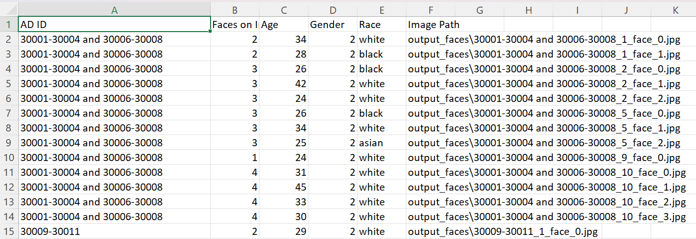

# FACE DETECTION AND ANALYSIS USING DEEPFACE 
# Face Insight

## Overview
**Face Insight** is a Python-based tool for extracting and analyzing faces from PDF documents. It converts PDFs to images, detects faces using MTCNN, and analyzes age, gender, and race using DeepFace. The extracted data is saved into a CSV file for further analysis.

## Features
- 🖼️ Converts PDFs into images
- 🔍 Detects faces using MTCNN
- 🧑‍🤖 Analyzes age, gender, and race with DeepFace
- 📊 Saves extracted data into a CSV file
- ⚡ Ideal for advertisement analysis and AI-powered document processing

## Installation
To use Face Insight, install the required dependencies:
```sh
pip install opencv-python numpy pandas pdf2image deepface mtcnn pillow
```

## Usage
Run the script by specifying the folder containing PDFs:
```sh
python script.py
```

## CSV Output Format
The processed face data is stored in a CSV file with the following columns:
```
AD ID, Faces on Image, Age, Gender, Race, Image Path
```

### Sample CSV Data
```
AD_001, 2, 25, Man, Asian, output_faces/AD_001_1_face_0.jpg
AD_002, 1, 30, Woman, Caucasian, output_faces/AD_002_1_face_0.jpg
```

###OUTPUT:

 
 

## Contributing
Feel free to fork this repository, submit issues, or suggest improvements.

## License
This project is licensed under the MIT License.

---


 
